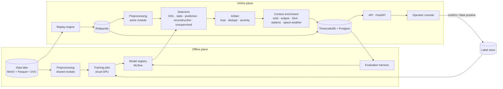

# Architecture

This document describes the intended design of Groundhog. It is written to be readable by someone who knows distributed systems but not spacecraft operations, and by someone who knows spacecraft operations but not Kubernetes.

Status: design document. Components marked *planned* do not exist yet.

---

## 1. Domain in five terms

| Term | Meaning |
|---|---|
| **Channel** | One measured parameter over time — `TM_EPS_BATT_V` is the battery voltage. A spacecraft has hundreds to thousands. |
| **Sample** | One measurement: `(channel, timestamp, value)`. The unit of data that flows through the system. |
| **Housekeeping telemetry** | The health data of the platform, as opposed to payload/science data. In ECSS PUS terms, mostly service 3 reports; service 5 carries events, service 1 telecommand verification. |
| **Detector** | Anything that reads samples and emits scores — a fixed threshold and a neural network are the same kind of component here. |
| **Event** | An anomaly candidate: a time interval over one or more channels, with a score, a severity and a context. What the operator sees. |

Three physical cycles shape every channel in low Earth orbit, and the detectors must treat them as normal: the ~95-minute orbit with its eclipse period, periodic reaction wheel desaturation, and passes over the South Atlantic Anomaly where radiation raises error counters. On top of those sit yearly seasonality and multi-year degradation.

## 2. Design principles

1. **Two planes, one preprocessing module.** The offline plane (research, training, evaluation) and the online plane (streaming, detection, console) share the exact same preprocessing code. Training/serving skew is prevented by construction, not by discipline.
2. **The replay engine is the backbone.** Historical data is never read as a file in a loop; it is replayed as a stream with mission-time semantics. Everything downstream sees the same interface whether the source is an archive or a live feed.
3. **Events, not samples, are the product.** A detector produces scores; an arbiter turns scores into events; events carry their explanation from birth.
4. **Classic limit checking stays.** It is fast, deterministic, explainable, and it is what the industry trusts. Groundhog runs it alongside the models and reports both.
5. **Operational metrics are first-class.** Detection quality without alarm volume, detection delay and cost per channel is not a result.
6. **Reproducibility is a feature.** One command, a pinned dataset version, a pinned image digest, fixed seeds.

## 3. System overview

## 4. Components

### 4.1 Data lake *(planned)*

MinIO with Parquet files, three zones:

- `raw/` — exactly as downloaded, never modified, checksummed.
- `normalized/` — the common schema (§5.1) as readings, partitioned by `mission / channel / month`.
- `features/` — windowed, scaled tensors ready for training.

Versioned with DVC so every model traces back to the exact data that produced it. Datasets are never committed to git.

### 4.2 Ingest and normalisation *(OPSSAT-AD in M1, other sources planned)*

One adapter per source (ESA-ADB, OPSSAT-AD, Mars Express, SatNOGS), all emitting the common sample schema as readings. Handles unit calibration, categorical channels and quality flags.

Implemented in `groundhog.ingest`: the `Source` interface and the OPSSAT-AD adapter. Kind and unit of every channel are declared in configuration, since guessing them is not acceptable, and labels never reach a reading.

### 4.3 Replay engine *(M1)*

The backbone. Reads a normalised mission window and publishes it to the bus as if it were arriving now.

Requirements:

- **Dual clock.** Every message carries `mission_ts` (the data's own time) and `wall_ts` (when it was published). Detectors reason on mission time; latency is measured on wall time.
- **Time compression.** A configurable factor; 1000× replays a year in about nine hours.
- **Gap fidelity.** A six-hour gap in the archive is replayed as six hours of silence (compressed), not skipped. Systems that never see gaps break on the first one.
- **Sampling fidelity.** Irregular and varying sample rates are reproduced as recorded.
- **Determinism.** Same data version, same window, same seed ⇒ the same samples in the same order. The speed factor is not part of the stream's identity: it changes when samples are published, never which or in what order. Without this there is no benchmark.
- **Checkpoint and resume.** A 17-year replay is not restarted because a pod was evicted.

Implemented in `groundhog.replay` (`python -m groundhog.replay --config configs/replay/opssat.yaml`). The clock, the sink and the checkpoint store are injected interfaces; M1 writes JSON lines to stdout and keeps its checkpoint in a local JSON file. Ordering and the role of the seed are recorded in [ADR 0003](docs/adr/0003-replay-ordering-and-seed.md), delivery guarantees in [ADR 0004](docs/adr/0004-replay-delivery-and-checkpoints.md).

### 4.4 Stream transport *(planned)*

Redpanda (Kafka API). One topic per mission, message key = channel id so per-channel ordering holds, schema registered (Avro or Protobuf), retention expressed in mission time.

Each detector is an independent consumer group: a new detector can replay history from offset zero without touching anything else, and a candidate model can consume the same stream in parallel with the incumbent.

### 4.5 Storage *(planned)*

- **Hot:** TimescaleDB hypertables with compression policies and continuous aggregates at 1 min / 1 h / 1 day, so the console can draw six months without scanning ten million rows.
- **Cold:** Parquet on MinIO for training and evaluation.
- **Events and labels:** plain Postgres tables.

### 4.6 Preprocessing *(planned)*

Shared by both planes. Windowing, resampling, per-channel scaling, gap policy.

Two rules that are not negotiable:

- **Scalers are fitted on the training period only.** Normalising with statistics computed over the whole dataset leaks future information and inflates every metric downstream.
- **Gaps are not silently interpolated.** Short gaps may be filled per channel configuration; long gaps propagate a quality flag all the way to the event.

### 4.7 Detectors *(planned)*

All implement the same interface: samples in, scores out.

| Id | Detector | Approach | Cost | Catches |
|---|---|---|---|---|
| R0 | Limit checking (OOL) | Static thresholds from config | negligible | Hard limit violations |
| R1 | Statistical baseline | Adaptive moving average + z-score | negligible | Sudden shifts, simple drift |
| R2 | Predictive | LSTM/TCN forecasts next value; large persistent error ⇒ anomaly | moderate | Per-channel behaviour change |
| R3 | Reconstruction | Autoencoder / VAE over a channel group | higher | Cross-channel correlation breaks |
| R4 | Unsupervised | Isolation Forest / ECOD over windows | very low | Broad outliers, cost reference |

R1 is mandatory and reported alongside every model. A neural detector that does not beat it is a finding, not a failure.

### 4.8 Arbiter *(planned)*

Consumes scores from all detectors and produces events: grouping consecutive flagged samples, fusing detectors that fire on the same window, deduplicating, suppressing repeats of a known ongoing event, assigning severity. Without this layer the operator receives a thousand notifications instead of ten events.

### 4.9 Context enrichment *(planned)*

At event creation, not on demand. Attaches:

- Sub-satellite point and orbital position (SGP4 / Skyfield with JPL ephemerides)
- Illumination: sunlight or eclipse, computed geometrically
- South Atlantic Anomaly crossing, from the IGRF magnetic field model
- Ground station visibility and elevation
- Space weather at that instant: Kp index and proton flux from NOAA SWPC
- Telecommands issued shortly before the event

This is what separates "error counter rose" from "error counter rose during a proton event while out of contact" — and it is computed once, stored with the event, and readable forever.

### 4.10 API and console *(planned)*

FastAPI over Postgres; the console never queries the database directly. React front end with a 3D orbital view (Three.js or Cesium), per-channel contribution bars, the context block, and two operator verdicts: confirm or false positive.

### 4.11 Feedback loop *(planned)*

1. Operator verdict → label store, with event id, window, channels, judge and timestamp.
2. Threshold of new labels reached → retraining workflow (Argo Workflows) rebuilds the training set, trains, evaluates on the held-out period.
3. New model registered in MLflow together with the DVC data version that produced it.
4. **Shadow mode:** the candidate consumes the same stream and emits scores into metrics only — no alarms — until its behaviour over several days is compared against the incumbent.
5. Promotion is a git commit applied by ArgoCD. Rollback is `git revert`.

### 4.12 Serving *(planned)*

KServe or BentoML. Each model is a versioned service with a declared resource budget, exposing latency and throughput. Models are never linked into the application process.

### 4.13 Observability *(planned)*

Prometheus, Grafana, OpenTelemetry. Beyond infrastructure metrics:

- Alarms per operator per day
- Detection delay, measured on mission time
- Input distribution drift against the training period
- p95 latency from sample to event, on wall time
- Millicores and megabytes per monitored channel
- End-to-end tracing: given an event, which samples produced it, which model version scored it, under which threshold configuration

In a domain where every anomaly triggers a formal investigation, that trace is a product feature.

### 4.14 Platform *(planned)*

k3s on a single workstation, Helm charts, ArgoCD for GitOps, GitHub Actions for CI, testcontainers for integration tests. Training jobs run on rented cloud GPUs; nothing else leaves the local cluster.

### 4.15 Evaluation harness *(planned)*

One command replays a defined window, runs the configured detectors, and produces a report containing the ESA-ADB event-wise metrics plus the operational metrics above. If a number cannot be regenerated this way, it does not go in the README.

## 5. Data model

### 5.1 Sample

| Field | Type | Notes |
|---|---|---|
| `mission` | string | Dataset / spacecraft identifier |
| `channel` | string | Channel id, e.g. `TM_EPS_BATT_V` |
| `mission_ts` | timestamp (UTC) | The data's own time |
| `wall_ts` | timestamp (UTC) | Publication time (replay or live) |
| `value` | float or int | Raw calibrated value |
| `kind` | enum | `numeric` · `categorical` · `counter` · `telecommand` |
| `unit` | string | Engineering unit, when known |
| `quality` | enum | `ok` · `stale` · `gap_filled` · `suspect` |

`kind` exists because averaging a status flag is meaningless. Mixing categorical and numeric channels in the same pipeline without distinguishing them is a common and silent error.

Before publication a sample is a **reading**: the same fields without `wall_ts`. Source adapters and the data lake deal in readings. The replay engine, or a live feed, turns a reading into a sample at the moment it publishes it ([ADR 0002](docs/adr/0002-readings-before-publication.md)).

### 5.2 Event

| Field | Notes |
|---|---|
| `id`, `mission` | |
| `t_start`, `t_end` | On mission time |
| `channels[]` | With per-channel contribution weight |
| `detectors[]` | Which detectors fired, with their delays |
| `score`, `severity` | |
| `context` | Illumination, SAA, station visibility, Kp, proton flux, recent telecommands |
| `status` | `new` · `triage` · `closed` |
| `verdict` | `confirmed` · `false_positive` · null |
| `model_versions[]` | For traceability |

## 6. The journey of one sample

At mission time 04:12 the battery voltage reads 27.9 V.

1. The replay engine reads it from Parquet and publishes it to Redpanda with both timestamps.
2. Four detectors consume it in parallel. **R0**: inside limits, nothing. **R1**: 2.1 sigma, borderline. **R2**: expected 28.4 V, error above threshold. **R3**: voltage and radiator temperature no longer move together the way they always have.
3. The arbiter sees the condition persisting for forty minutes, opens an event, assigns medium severity.
4. Enrichment attaches: in eclipse, over the Pacific, no ground contact, Kp quiet — therefore not space weather, therefore the spacecraft.
5. The event lands in Postgres and appears in the console with its three contributing channels and the orbital context.
6. The operator confirms. The verdict enters the label store and becomes part of the next training set; the resulting model runs in shadow mode before replacing the incumbent.
7. Throughout, Prometheus recorded: 1.2 s from sample to event, 40 millicores per channel for this model, nine alarms today.

## 7. Technology choices

| Layer | Choice | Why, and what was considered |
|---|---|---|
| Language | Python 3.12 | The domain's language; the ESA baselines are Python |
| Orbital mechanics | Skyfield + SGP4 | Pure Python, adequate for context; Orekit rejected as JVM-heavy for this scope |
| Magnetic field | IGRF (`ppigrf`) | Computed SAA instead of a hand-drawn ellipse |
| Stream | Redpanda | Kafka API without the JVM footprint; single-node friendly |
| Hot store | TimescaleDB | Postgres semantics, continuous aggregates; InfluxDB rejected to keep one database engine |
| Cold store | MinIO + Parquet | S3 API, portable to any cloud |
| Data versioning | DVC | Ties model to dataset version; Git LFS rejected for large tabular data |
| Training | PyTorch | ESA baselines and the literature |
| Tracking | MLflow | Registry plus artefact store; W&B rejected to keep data local |
| Serving | KServe or BentoML | Decision deferred to an ADR |
| Orchestration | Argo Workflows | Already Kubernetes-native alongside ArgoCD |
| Platform | k3s + Helm + ArgoCD | GitOps, reproducible, runs on one workstation |
| Console | React + Three.js | Cesium considered; heavier, evaluate when the globe needs real imagery |

## 8. Deployment topology

- **Workstation:** the whole online plane on k3s — replay, Redpanda, TimescaleDB, MinIO, detectors, API, console, observability stack.
- **Rented cloud GPU:** training jobs only. Data is prepared locally, uploaded as ready windows to an S3-compatible bucket, the job trains, checkpoints each epoch to the bucket, uploads weights, and terminates itself.
- **The same container image** runs locally on CPU and remotely on GPU.

## 9. Non-goals

- Onboard / edge deployment of models.
- Replacing a mission control system. Groundhog integrates with one (Yamcs is the target), it does not reimplement one.
- Commanding the spacecraft. Read-only, always.
- Beating the state of the art in time-series anomaly detection. The contribution is the system and the measurement, not a new architecture.

## 10. Open questions

To be resolved with an ADR each, in `docs/adr/`:

1. Serving: KServe or BentoML.
2. Event schema versioning strategy across model versions.
3. Per-channel versus channel-group models: where the boundary sits for R3.
4. How ground truth is handled for events discovered *after* the labelled period ends.
5. Yamcs integration: parallel consumer, or Groundhog as a Yamcs plugin.
